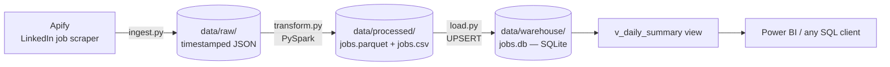

# Warsaw Data Engineer Job Market Pipeline

[](https://github.com/i-mran905/warsawdataengineerjobpipeline/actions/workflows/ci.yml)

An end-to-end batch data pipeline that tracks live "Data Engineer" job
postings in Warsaw, Poland and scores each one against my real skill set.
I built it while applying for data engineering roles in Warsaw, so its output
answered a question I was dealing with directly: how many suitable roles were
available, and what skills did they require?

## Overview

The pipeline pulls live postings, cleans and classifies them with PySpark,
and loads them into a small SQL warehouse you can query or point a BI tool
at. It runs in three decoupled stages (ingest → transform → load), each a
single script that reads what the previous one wrote.

## Business problem

The project measures the number and seniority of available roles and compares
their requested skills with my current skills. It turns a narrow job-search
question into a repeatable ingest, transform, and load workflow.

## Architecture



More detail in [`docs/architecture.md`](docs/architecture.md).

## Folder structure

```
.
├── ingest.py              # Apify -> data/raw/*.json
├── transform.py           # PySpark clean/dedupe -> data/processed/
├── load.py                # parquet -> SQLite warehouse (upsert)
├── normalize.py           # title/seniority/city cleanup, split out so it's testable
├── tests/test_normalize.py
├── docs/                  # architecture, engineering decisions, db design, testing, etc.
├── sample_output/         # a real run, committed so you can see the data shape
├── requirements.txt
├── requirements-dev.txt   # pytest, ruff
└── pyproject.toml
```

## Pipeline flow

1. **`ingest.py`** — Pulls live LinkedIn postings via the Apify
   `cheap_scraper/linkedin-job-scraper` actor (keyword "Data Engineer",
   location Warsaw), scoring each against my real skills (Python, SQL,
   PySpark, Databricks, Git, Machine Learning, Azure, C++) using Apify's
   keyword matching. Writes one timestamped, untouched JSON snapshot per run
   to `data/raw/`.
2. **`transform.py`** — Cleans the snapshot with PySpark: dedupes by job ID,
   strips decorative emoji from titles, derives a `seniority` bucket from the
   title (falling back to LinkedIn's `experienceLevel`), and extracts a clean
   city. Writes `jobs.parquet` and `jobs.csv`.
3. **`load.py`** — Loads into a SQLite warehouse with an upsert keyed on job
   ID, plus a `v_daily_summary` view for a quick SQL sanity check.

## Technology stack

Python · PySpark · SQLite · Apify · pytest · ruff · GitHub Actions.
Local-only — no cloud infrastructure required to run it.

## Engineering decisions

The choices worth explaining — title-first seniority classification,
immutable timestamped raw snapshots, SQLite over Postgres, idempotent upsert
load, and separating pure logic from Spark — are written up in
[`docs/engineering-decisions.md`](docs/engineering-decisions.md).

## Data quality strategy

- **Dedupe** by `jobId` (the source occasionally repeats a posting across
  paginated results).
- **Title cleanup** strips decorative emoji so titles group correctly.
- **Seniority** is read from the high-signal title first, with LinkedIn's
  often-blank `experienceLevel` as fallback only.
- **Idempotent load** keyed on `jobId` means re-running never duplicates or
  drifts.

## Error handling strategy

- `ingest.py` catches a failed Apify run and reports the reason instead of
  dumping a raw traceback.
- `transform.py` handles a missing/corrupt input file explicitly and always
  closes the Spark session via `try/finally`.
- `load.py` rolls back the SQLite transaction on a write failure rather than
  leaving a half-applied load.

## Testing

```bash
pip install -r requirements-dev.txt
ruff check .
ruff format --check .
pytest
```

`normalize.py`'s title/seniority/city logic has 13 unit tests. The scope and
the honest gaps (no mocked ingest test, no in-CI Spark test) are covered in
[`docs/testing.md`](docs/testing.md).

## CI/CD

GitHub Actions runs ruff + pytest on every push and PR to `main`. There's no
continuous deployment because the pipeline isn't a deployed service — it runs
locally on demand. The full picture, including how I'd productionize it, is in
[`docs/deployment.md`](docs/deployment.md).

## Database design

One `jobs` table keyed on `jobId`, array fields flattened to pipe-delimited
text, plus a `v_daily_summary` view. Schema and the Postgres migration path
are in [`docs/database-design.md`](docs/database-design.md).

## How to run

**Prerequisites:** Python 3.9+ and a Java runtime (8/11/17) on `PATH` for
PySpark.

```bash
pip install -r requirements.txt
export APIFY_API_TOKEN="your-token-from-console.apify.com"

python ingest.py       # -> data/raw/raw_linkedin_jobs_*.json
python transform.py    # -> data/processed/jobs.parquet + jobs.csv
python load.py          # -> data/warehouse/jobs.db
```

## Expected output

`transform.py` logs a seniority breakdown and average match score per bucket;
`load.py` reports rows upserted and prints `v_daily_summary`. The
`sample_output/` folder has a real committed run so you can see the data
shape without running anything: `raw_snapshot_sample.json` (126 postings) and
`jobs_sample.csv` (the cleaned version).

One finding from the July 2026 snapshot: of 126 Warsaw "Data Engineer"
postings, only 9 were explicitly junior-level, and junior postings had the
lowest average skill-match score of any seniority bucket — a small
entry-level market, and the few roles that exist ask for a narrower overlap
with a typical junior skill set.

## Screenshots

<!-- TODO: add a screenshot of the warehouse open in Power BI / DB Browser,
     and of a CI run passing. -->

_Placeholder — screenshots of the warehouse in a BI tool and a passing CI run
to be added._

## Future improvements

Mocked ingest tests, an in-CI Spark test, posting-history tracking for
trends, and a Postgres/orchestrated productionization path — see
[`docs/future-improvements.md`](docs/future-improvements.md).

## Lessons learned

- **Separating pure logic from the framework pays off immediately.** Pulling
  the title/seniority/city functions out of the Spark job into `normalize.py`
  turned untestable code into a fast unit-tested module — the single change
  I'd carry into every future pipeline.
- **A blank source field is a design input, not an edge case.** LinkedIn's
  `experienceLevel` being empty a third of the time is what drove the
  title-first classification; noticing that early shaped the whole transform.
- **Idempotency is worth designing in from the start.** Keying the load on
  `jobId` with an upsert meant I could re-run freely while developing without
  ever cleaning up duplicates.

## License

[MIT](LICENSE)

## Contributing

See [CONTRIBUTING.md](CONTRIBUTING.md).
