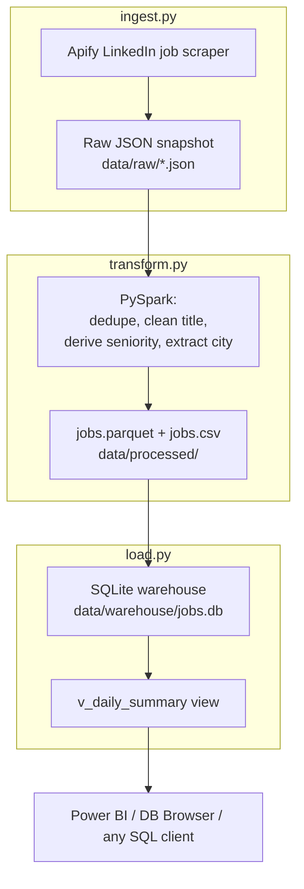

# Architecture

## Overview

This is a batch ELT-style pipeline that runs in three stages, one script each,
communicating through files on disk rather than a message queue or shared
database. Each stage reads what the previous one wrote and writes its own
output, so any stage can be re-run on its own without re-running the whole
chain.

## Why file-based stages

The three stages are deliberately decoupled through the filesystem:

- **Raw is immutable.** `ingest.py` writes one timestamped file per run and
  never overwrites. If a transform assumption turns out wrong, the original
  API response is still there to re-process — nothing is lost to an
  in-place mutation.
- **Each stage is independently runnable.** During development I re-ran
  `transform.py` against the same raw snapshot dozens of times while tuning
  the seniority logic, without paying for another Apify run each time.
- **Failure is isolated.** A crash in `transform.py` can't corrupt the raw
  layer, and a crash in `load.py` can't corrupt the processed layer.

This mirrors the raw → processed → warehouse (bronze/silver/gold) layering
used in larger lakehouse setups, just scaled down to a single machine.

## Stage responsibilities

| Stage | Script | Reads | Writes | Engine |
|-------|--------|-------|--------|--------|
| Ingest | `ingest.py` | Apify API | `data/raw/*.json` | Python + apify-client |
| Transform | `transform.py` | latest raw JSON | `data/processed/jobs.{parquet,csv}` | PySpark |
| Load | `load.py` | `jobs.parquet` | `data/warehouse/jobs.db` | pandas + sqlite3 |

## Where the logic lives

The only non-trivial business logic — cleaning job titles, classifying
seniority, extracting a city — is factored out of `transform.py` into
`normalize.py` as pure functions. `transform.py` wraps them in PySpark UDFs.
This split exists so the logic can be unit-tested in milliseconds without
starting a JVM (see `docs/testing.md`).
